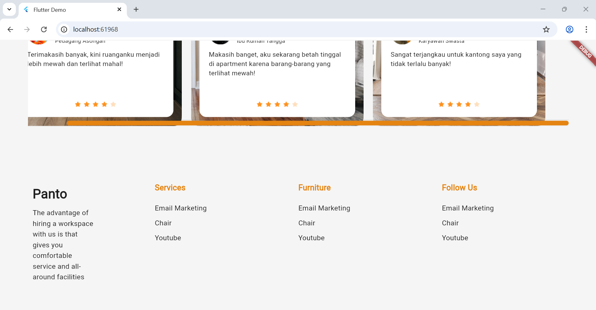

## Redefining the Web with Flutter! 🚀

This project, **Panto Furniture Landing Page**, is a **pixel-perfect, fully responsive landing page** built entirely with **Flutter Web**. It serves as a proof-of-concept, demonstrating that a single **Dart language** codebase can now deliver high-fidelity, production-ready websites. Flutter is establishing a new benchmark for web quality and responsive design.

---

## ✨ Features & Architecture

This implementation showcases the power and flexibility of Flutter for professional web applications:

* **Pixel-Perfect Responsiveness:** The popular Panto UI design is brought to life flawlessly on **Mobile 📱**, **Tablet 💻**, and **Desktop 🖥️** breakpoints, maintaining perfect fidelity across all screen sizes.
* **Architecture First:** Built with reusable **Flutter Widgets** and a clean, highly scalable codebase that prioritizes maintainability.
* **Modern UX:** Features custom animations and contemporary **Material Design** styling.

---
### Prerequisites

You will need the following installed:

* **Flutter SDK:** Ensure you have the latest stable version.
* **Dart SDK**
* An IDE (VS Code or Android Studio) with the Flutter and Dart plugins installed.

## 🛠️ Built With

* **Flutter**
* **Dart**

## See the UI in Action

Here's a glimpse of the Khanna app in action:

